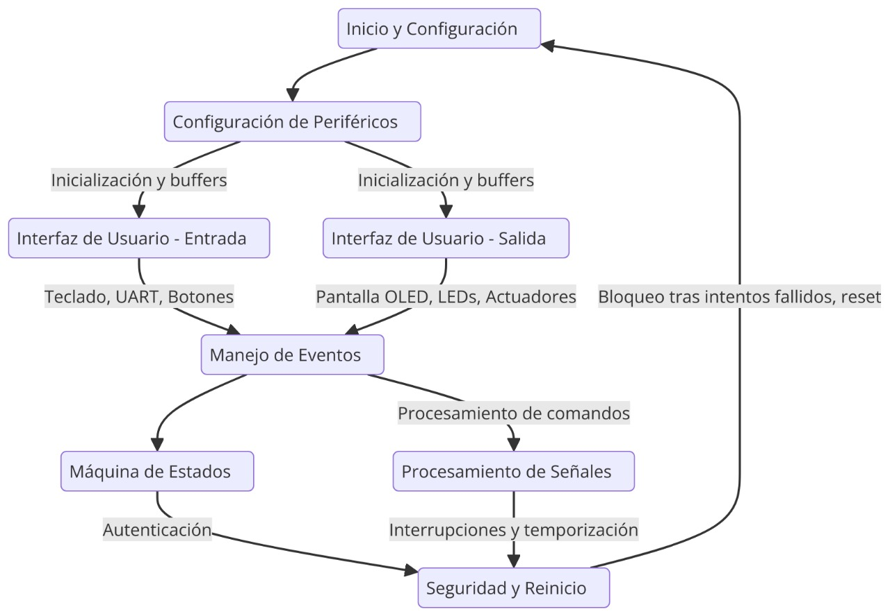
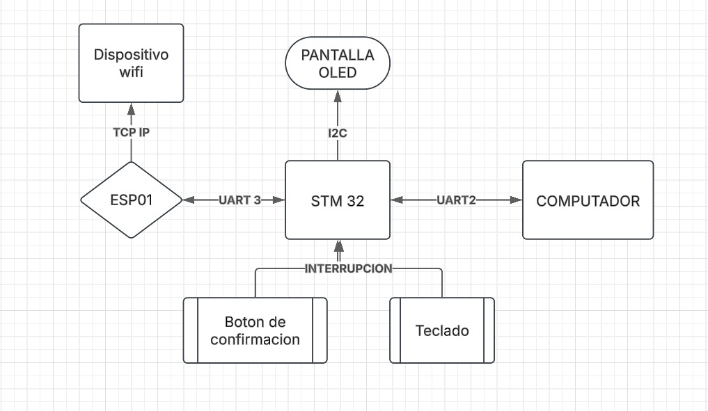

# Access Control System 🚪🔒
### **Universidad Nacional de Colombia - Parcial Final de Estructuras Computacionales**
📌 **Presentado por:** Santiago Zambrano, Mateo Duque 

---

## 📌 **Descripción del Proyecto**
Este es un **sistema de control de acceso** basado en el microcontrolador **STM32L476RG**, el cual permite la autenticación mediante una contraseña ingresada a través de un **teclado matricial**, y el control de una **puerta automatizada** mediante comandos por **UART** y un **botón físico**. 

El sistema utiliza un **display OLED** para mostrar información en tiempo real y **almacena los intentos de acceso**. Además, cuenta con un **modo de seguridad**, en el cual se bloquea tras varios intentos fallidos.

El sistema también permite la comunicación remota mediante un **servidor Flask**, que interactúa con un **ESP-01** para la gestión de accesos a través de una aplicación web.

🎥 **Demostración en video:** [Ver en YouTube](https://youtu.be/DNegv7Jh04g)

---

## ⚙️ **Características principales**
✅ **Autenticación segura** con un teclado matricial.  
✅ **Control de acceso mediante comandos UART.**  
✅ **Interrupciones externas** para detección del botón y el timbre.  
✅ **Pantalla OLED SSD1306** para mostrar mensajes de estado.  
✅ **Servidor Flask** para la gestión remota de accesos.  
✅ **Estados de la puerta:**
   - 🔒 **Cerrada**
   - 🚪 **Abierta temporalmente**
   - 🔓 **Abierta permanentemente**
   - 🔔 **Modo timbre**
✅ **Tiempo de apagado automático** para evitar consumo innecesario de energía.  

---

## 🛠 **Componentes Utilizados**
- **Microcontrolador:** STM32L476RG (Nucleo Board)
- **Pantalla OLED:** SSD1306
- **Teclado matricial**
- **Botón físico para apertura manual**
- **Interfaz UART para control remoto**
- **ESP-01** para comunicación con el servidor Flask
- **Servidor Flask** para gestión de accesos remotos
- **LEDs indicadores de estado**
- **Timbre para señalizar eventos**
- **Fuente de alimentación 3.3V/5V**

---

## 🔧 **Configuración del Proyecto**
### **1️⃣ Configuración de Hardware**
| **Pin**  | **Función** | **Descripción** |
|----------|------------|----------------|
| `PA0`   | Botón      | Detección de apertura manual |
| `PA5`   | LED        | Indicador de estado |
| `PC11`  | Timbre     | Activación del timbre |
| `USART2` | UART       | Comunicación serie con la PC |
| `I2C1`  | I2C        | Comunicación con el OLED |
| `ESP-01` | WiFi      | Comunicación con el servidor Flask |

### **2️⃣ Configuración en STM32CubeMX**
- **GPIO:**
  - `PA0`: `External Interrupt Mode with Falling edge trigger detection`
  - `PC11`: `Output Mode` (para timbre)
  - `PA5`: `Output Mode` (para LED indicador)
- **UART:**
  - `USART2` habilitado para comunicación con la PC.
- **I2C:**
  - `I2C1` configurado para el **OLED SSD1306**.

---

## 🌐 **Servidor Flask y Comunicación con ESP-01**
El servidor Flask se encarga de gestionar los accesos y enviar comandos al STM32 a través del ESP-01. La comunicación se realiza mediante peticiones HTTP, donde los usuarios pueden **abrir/cerrar la puerta** a través de una interfaz web.

**Flujo de comunicación:**
1. **Usuario accede a la interfaz web.**
2. **Envía una solicitud al servidor Flask.**
3. **Flask procesa la solicitud y envía el comando al ESP-01.**
4. **ESP-01 retransmite la información al STM32 a través de UART.**
5. **STM32 ejecuta la acción (abrir/cerrar puerta).**

---

## 🌀 **Diagramas del Sistema**
### **Diagrama de Bloques**

### **Diagrama de Funcionamiento**

---

## 📜 **Código Fuente Principal (`main.c`)**
El código principal realiza las siguientes tareas:
1. **Inicialización de periféricos** (UART, GPIO, I2C, OLED, Keypad).
2. **Manejo de la autenticación** mediante el teclado.
3. **Control de la puerta según comandos recibidos** (`*A*` para abrir, `*C*` para cerrar).
4. **Manejo de interrupciones**:
   - **Botón en PA0**: Abre la puerta cuando es presionado.
   - **Timbre en PC11**: Enciende una señal visual/auditiva.
5. **Sistema de seguridad**:
   - Se bloquea después de **tres intentos fallidos**.
   - Se apaga automáticamente tras **1 minuto de inactividad**.

---

## 📈 **Conclusiones**
- Se implementó un sistema de control de acceso seguro y eficiente.
- La integración de un servidor Flask permite una administración remota del sistema.
- Se aseguró un bajo consumo de energía mediante apagado automático.
- El ESP-01 facilitó la conectividad entre el microcontrolador y el servidor web.

📍 **Palabras clave:** STM32, ESP-01, Flask, Control de Acceso, Seguridad, UART, IoT.